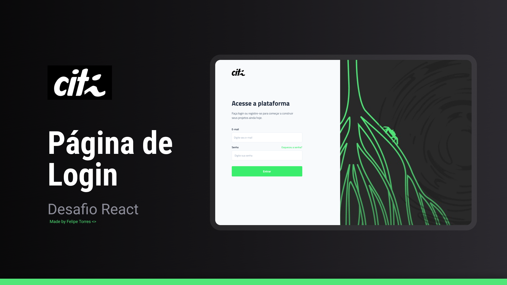

<!-- PROJECT LOGO -->
<br />
<p align="center">
  <a href="https://github.com/citi-onboarding/pta-boilerplate">
    
  </a>

  <h3 align="center">PTA</h3>

  <p align="center">
  Esse boilerplate foi criado durante o processo seletivo de 2024 do CITi e atualizado em 2024.1 com o intuito de aproximar as pessoas aspirantes à realidade
  dentro do CITi. O boilerplate será usado para o envio de um DESAFIO durante a última etapa do processo seletivo, a qual tem o objetivo de capacitar tecnincamente as pessoas que entrarão no CITi.
    <br />
    <a href="https://github.com/citi-onboarding/pta-boilerplate"><strong>Explore the docs »</strong></a>
    <br />
    <br />
    ·
    <a href="https://github.com/citi-onboarding/pta-boilerplate/issues">Report Bug</a>
    ·
    <a href="https://github.com/citi-onboarding/pta-boilerplate/issues">Request Feature</a>
  </p>
</p>


<!-- TABLE OF CONTENTS -->
<details open="open">
  <summary><h2 style="display: inline-block">Tabela de Conteúdo</h2></summary>
  <ol>
    <li><a href="#about-challenge">About Challenge</a></li>
      <ul>
        <li><a href="#challenge">Challenge</a></li></li>
      </ul>
    <li><a href="#client">Client</a></li>
        <ul>
          <li><a href="#how-to-install-client">How To Install Client</a></li></li>
          <li><a href="#how-to-run-client">How To Run Client</a></li></li>
        </ul>
    </ul>
    <li><a href="#contact">Contact</a></li>
  </ol>
</details>
<br/> 

# About Challenge
<br/>

  Esse desafio foi criado durante o processo seletivo de 2024 do CITi e ele tem o intuito de aproximar as pessoas aspirantes à realidade
  dentro do CITi. O boilerplate será usado durante a última etapa do processo seletivo, a qual tem o objetivo de capacitar tecnicamente as pessoas que entrarão no CITi.

<p align= "center">
    
</p>

## Challenge
Sua missão é construir uma página web em React que reproduza fielmente o design disponível no seguinte link do Figma: 
<a href="https://www.figma.com/file/BklrSFl01OCseYDol7tDu1/Desafio-React--%E2%9A%9B%EF%B8%8E---CITi?type=design&mode=design&t=3YKy0IXKwA9Tdx4P-1" target="_blank">
    Desafio React ⚛︎ - CITi
</a>

O design fornecido no Figma representa a estrutura visual da página que queremos que você construa. Certifique-se de atentar para os detalhes visuais, como cores, fontes, espaçamento e posicionamento dos elementos.

### Step by Step:

1. Coloque uma estrelinha no repositório 💚 e faça um fork dele.
2. Clone o repositório forked para o seu ambiente local.
3. Utilize React para construir a página conforme o design do Figma.
4. Mantenha a estrutura do projeto organizada.
5. Certifique-se de que o código seja limpo e bem comentado.

<br/> 


## Client

<br/>

## How To Install Client

<br/>

1. Entre na pasta /client do repositório

2. Abra a pasta /client  no vscode

3. Vá em terminal e abra o novo terminal 

4. Com o terminal aberto, escreva essa sentença abaixo e dê enter

   ```sh
   yarn install
   ```
<br/> 

## How To Run Client

<br/>

1. Entre na pasta /client do repositório

2. Abra a pasta /client no vscode

3. Vá em terminal e abra o novo terminal 

4. Com o terminal aberto, escreva as sentenças abaixo e dê enter

   ```sh
   yarn build
   ```

   e 

   ```sh
   yarn start
   ```

3. Espere que o terminal esteja dessa maneira

    <p align= "center">
        
    </p>

<br/> 

## Contact

<br/>

- [Felipe Torres](https://github.com/ftm2-cin), Fullstack Developer 2023.2 - ftm2@cin.ufpe.br

<br/>
